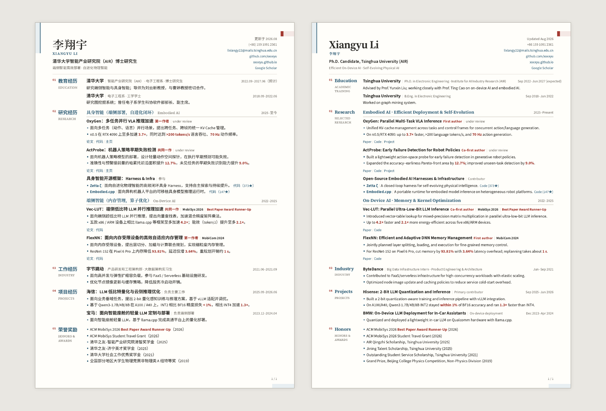

# Xiangyu Li — Resume

A print-first, bilingual academic resume and publication list built with React
and Vite. The website renders true-size A4 pages in the browser and exports the
same layout to PDF with Playwright.

[Live preview](https://xxxxyu.github.io/resume/?locale=zh&edition=complete) ·
[English version](https://xxxxyu.github.io/resume/?locale=en&edition=complete) ·
[Chinese PDF](https://xxxxyu.github.io/resume/downloads/zh/resume.complete.pdf) ·
[English PDF](https://xxxxyu.github.io/resume/downloads/en/resume.complete.pdf) ·
[All PDF builds](https://github.com/xxxxyu/resume/actions/workflows/pages.yml)

> 中文简介：这是我的中英文个人简历源码。网页版、单页 PDF、完整简历和论文列表共用同一套内容与排版。欢迎 fork / clone [GitHub 仓库](https://github.com/xxxxyu/resume) 按需修改。你的 star 对我很重要，多谢！



## What is included

- Chinese and idiomatic English content with a shared layout system.
- Independent language and document-length controls.
- A4-sized browser pages with automatic publication-list pagination.
- Responsive preview scaling: true-size A4 on large displays and proportional
  fit-to-width scaling on tablets and phones.
- Stacked, preview-only contact and template-reuse notes above the A4 pages.
- Stable Chromium-based PDF and PNG export.
- Local, version-controlled Latin and CJK web fonts—no font CDN or system font
  installation is required.
- Optional synchronization of publications, citations, links, and GitHub star
  counts from my personal-homepage repository.
- GitHub Pages deployment and fresh PDF artifacts from every push to `main`.

## Preview locally

Install Node.js 20 or newer, then run:

```bash
npm install
npm run dev
```

`npm run dev` first refreshes data from my adjacent personal-homepage checkout,
which defaults to `../xxxxyu.github.io`. If you cloned this repository without
that data source, use the committed snapshot instead:

```bash
npm install
npm run dev:cached
```

The available routes are:

```text
?locale=zh&edition=one-page
?locale=zh&edition=complete
?locale=zh&document=publications
```

Replace `zh` with `en` for the English documents. The toolbar and stacked
introductory notes are preview-only and are omitted automatically when printing
or exporting. On large displays, pages remain at their physical A4 size; on
narrower screens, the complete preview scales down uniformly without changing
the print layout.

## Use the design for your own resume

Fork or clone the repository and replace the authored content in:

- `content/zh/resume.json` — Chinese profile, resume sections, and UI labels.
- `content/en/resume.json` — English content and labels.
- `src/generated/homepage.json` — publication metadata and cached dynamic data.

Most text changes require no React edits. `profile` controls the name and
contacts, `sections` contains resume entries, `paperGroups` controls publication
grouping, and `paperOverrides` can replace synchronized paper fields by ID.

My synchronization adapter is intentionally kept in the public repository as a
working example. To connect another data source, edit `resume.config.json` and
`scripts/sync-homepage.mjs`; otherwise, maintain `src/generated/homepage.json`
directly and use the `:cached` commands. An AI coding agent can usually perform
the initial content replacement and source adaptation in one pass.

Please remove my personal information and authored resume content before using
the result as your own. Feel free to fork or clone the repository and adapt it
to your needs. Your star means a lot to me—thank you!

## Build and export

A deterministic build uses the committed data snapshot:

```bash
npm run build
```

To synchronize my homepage data before building:

```bash
npm run build:sync
```

Generate the six PDFs and matching full-page PNG previews:

```bash
npm run render
```

For a clone without the personal-homepage data source, use:

```bash
npm run render:cached
```

Artifacts are written under the ignored `output/{zh,en}/` directory. The
renderer waits for bundled fonts, measures publication entries after layout,
validates A4 bounds, and then exports through headless Chromium. Generated PDFs
and full-page PNGs are intentionally not committed; every `main` build uploads
the six PDFs as a 30-day `resume-pdfs` GitHub Actions artifact and publishes
stable copies under the Pages site's `/downloads/{zh,en}/` paths.

The README preview is the one deliberate exception. After an approved,
substantial layout change, regenerate the bilingual first-page montage with:

```bash
npm run render:cached
npm run render:readme-preview
```

The second command requires Poppler's `pdftoppm`. It is not part of the regular
build, render, or deployment workflow, so routine commits do not churn the
checked-in preview image.

## Content and rendering architecture

```text
content/{zh,en}/resume.json   Authored bilingual resume content
src/generated/homepage.json  Committed snapshot of synchronized data
src/data/index.js             Locale and paper-reference resolution
src/documents/                Resume and publication page composition
src/components/               Shared entry and typography components
src/styles/main.css           A4 screen and print layout
scripts/sync-homepage.mjs     Personal-homepage data adapter
scripts/render.mjs            Pagination checks and PDF/PNG export
scripts/render-readme-preview.mjs  Opt-in bilingual README montage
public/fonts/                 Bundled, self-contained web fonts
```

The separation is deliberate: normal wording changes happen in JSON, source
synchronization happens in one adapter, and layout changes stay in React/CSS.

## Deploy to GitHub Pages

The workflow in `.github/workflows/pages.yml` checks out both this repository
and my public homepage data, installs locked npm dependencies, rebuilds the
site with the `/resume/` project base path, verifies all four bundled fonts,
renders and uploads the PDF artifact, and deploys `dist`.

For a fork:

1. Update or remove the personal-homepage checkout and synchronization step.
2. Change `RESUME_BASE_PATH` to `/<your-repository-name>/`.
3. Open **Settings → Pages** and select **GitHub Actions** as the source.
4. Push to `main`.

## Fonts and reproducibility

The repository includes Source Sans 3, Source Serif 4, and Chinese subsets of
Noto Sans SC and Noto Serif SC under `public/fonts/`. Vite copies them into every
production build and rewrites their URLs for the configured Pages base path.
The deployment workflow fails if any expected font is missing.

See [THIRD_PARTY_NOTICES.md](THIRD_PARTY_NOTICES.md) and the bundled
[SIL Open Font License](licenses/OFL-1.1.txt) for attribution and license terms.

## License

The original application code and visual implementation are available under
the [MIT License](licenses/MIT.txt). Personal information and authored resume
content are not included in that grant. See [LICENSE.md](LICENSE.md) for the
exact scope.
